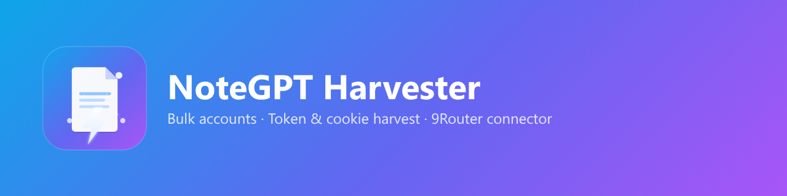

<div align="center">



# NoteGPT Harvester

**Crea cuentas de NoteGPT en masa, extrae tokens y cookies de sesión automáticamente y conecta cada cuenta directamente a [9Router](https://9router.com) — de principio a fin.**

[](LICENSE)
[](https://www.python.org/)
[](#)
[](#)
[](https://9router.com)

[English](README.md) · [Bahasa Indonesia](README.id.md) · [中文](README.zh.md) · [日本語](README.ja.md)

</div>

---

## ✨ Qué hace

1. **Genera direcciones desechables** desde un proveedor tipo Zenvex.
2. **Registra cuentas de NoteGPT** usando la API real (`/api/v1/auth/email/register`).
3. **Confirma el correo automáticamente** sondeando la bandeja y extrayendo el token.
4. **Inicia sesión y extrae credenciales** — el `access_token` (mismo valor que el sitio guarda como `X-Token` y la cookie `nc_token`) más la cuota.
5. **Conecta cada cuenta a 9Router** vía su management API, dejando todos los tokens enrutables desde un único endpoint compatible con OpenAI.

Todo con concurrencia limitada, reintentos, checkpoint reanudable y salidas JSON/CSV/token limpias.

## 🚀 Inicio rápido

```bash
git clone https://github.com/0xgetz/notegpt-harvester.git
cd notegpt-harvester
python -m venv .venv && source .venv/bin/activate
pip install -e .
cp config.example.toml config.toml
```

```bash
npx 9router                              # inicia 9Router (puerto 20128)
ngharvest run -n 5 --concurrency 3       # crea 5 cuentas y las conecta
ngharvest run -n 3 --no-router           # solo extrae, sin 9Router
```

## 🛠️ Comandos

| Comando | Propósito |
| --- | --- |
| `ngharvest run` | Crear en masa, extraer tokens, importar a 9Router |
| `ngharvest test-router` | Verifica la conexión con 9Router |
| `ngharvest verify <email> <pass>` | Inicia sesión y muestra token + cuota |

Flags: `-n/--count`, `-j/--concurrency`, `--proxy`, `--no-router`, `--password`, `--results-dir`, `-v/--verbose`.

## 📂 Salida

```text
results/
├── accounts.json   # registros completos: token, cuota, cookies, fechas
├── accounts.csv    # email,password,token,user_id,verified
└── tokens.txt      # un token por línea
```

## ⚙️ Configuración

Copia `config.example.toml` → `config.toml`. Todos los campos admiten variables de entorno `NGH_*` (`NGH_COUNT`, `NGH_ROUTER_URL`, `NGH_ROUTER_API_KEY`, `NGH_PROXY`, …).

## 🔐 Seguridad y ética

- **Nunca subas `config.toml`, `results/` ni `harvest.state.json`** (ya están en .gitignore).
- Los tokens extraídos dan acceso a sus cuentas: trátalos como contraseñas.
- Úsalo solo en servicios que puedas automatizar y respeta sus ToS y la ley local.

## 📄 Licencia

[MIT](LICENSE) © 2026 notegpt-harvester contributors.

<div align="center"><sub>No afiliado con NoteGPT ni 9Router. Úsalo con responsabilidad.</sub></div>
